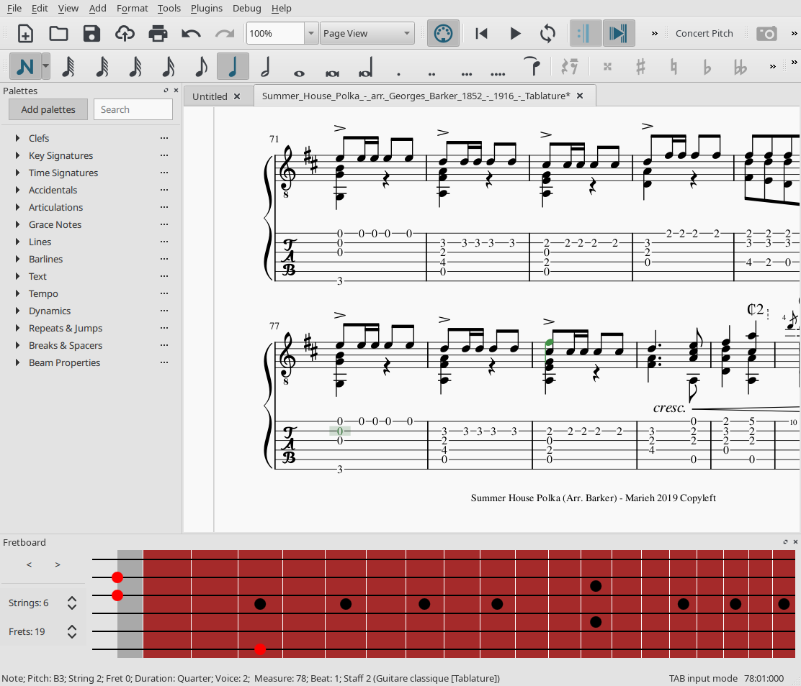

# Fretboard
A plugin for MuseScore which provides a simple fretboard for visualizing and editing tablature scores.

Supports MuseScore 4 and MuseScore 3 since the version 3.3.

## Features
- Visualizing currently selected notes and chords
- Editing notes in existing chords
- Adding new notes while in Note Input mode
- Detection of strings, frets and tuning configuration for the current instrument (works best with MuseScore 3.5 or later)

## Links
- This plugin's page on musescore.org: \
  https://musescore.org/en/project/fretboard
- Forum thread for discussions and update announcements: \
  https://musescore.org/en/node/295404
